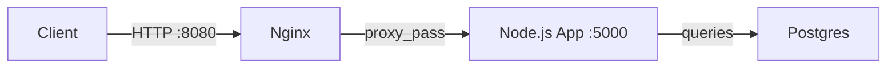
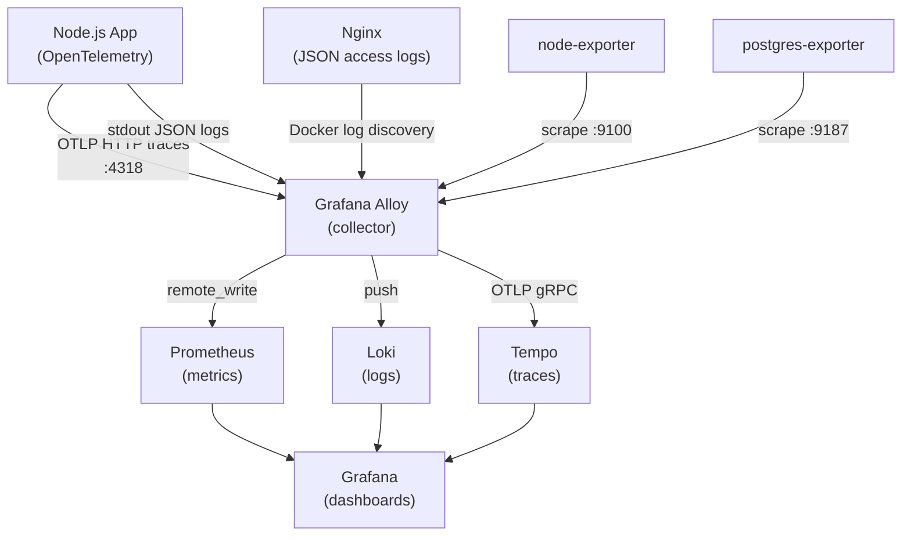
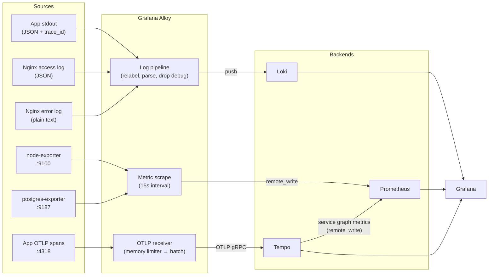

# Observability Demo Platform

Built as a bachelor's thesis project, this is a self-contained observability and monitoring stack built with Docker Compose, designed for learning and demonstrating modern observability concepts. The platform instruments a Node.js application end-to-end, collecting logs, metrics, and distributed traces, and visualizes all three signals in Grafana.

> **Note:** PostgreSQL is populated with dummy/demo data. This project is intended as a learning and demonstration environment, not a production deployment.

---

## Table of Contents

- [Architecture Overview](#architecture-overview)
- [Folder Structure](#folder-structure)
- [Features](#features)
- [Getting Started](#getting-started)
- [Generating Demo Traffic](#generating-demo-traffic)
- [Monitoring Data Flow](#monitoring-data-flow)
- [Screenshots](#screenshots)
- [Future Improvements](#future-improvements)

---

## Architecture Overview

### Request Flow



### Telemetry Pipeline



### Component Roles

| Component | Role |
|---|---|
| **Nginx** | Reverse proxy on port 8080. Emits structured JSON access logs and plain-text error logs, both collected by Alloy via Docker log discovery. |
| **Node.js App** | Express application instrumented with OpenTelemetry. Sends traces to Alloy over OTLP HTTP and emits structured JSON logs with injected `trace_id` / `span_id` for log–trace correlation in Grafana. Includes a built-in UI for generating demo traffic — select HTTP method, enter a URI, and optionally repeat requests to produce logs, traces, and metrics on demand. |
| **PostgreSQL** | Database populated with demo data. Monitored via `postgres-exporter` and `pg_stat_statements` for query-level metrics. |
| **Grafana Alloy** | Central collector. Scrapes metrics from node-exporter and postgres-exporter, receives OTLP traces from the app, and discovers and ships container logs, all forwarded to the appropriate backend. |
| **Loki** | Log aggregation backend. Receives logs from Alloy, stores them with labels derived from Docker metadata, and serves LogQL queries from Grafana. |
| **Prometheus** | Metrics storage. Receives metrics from Alloy via remote_write and serves PromQL queries from Grafana. |
| **Tempo** | Distributed trace backend. Receives spans from Alloy over OTLP gRPC, stores them, and generates RED metrics (rate, error, duration) that are written back to Prometheus. |
| **Grafana** | Visualization layer. Provisioned on startup with all three datasources (Loki, Prometheus, Tempo) and cross-datasource linking: clicking a `trace_id` in a log line opens the trace in Tempo; a span in Tempo can jump to matching Loki logs. |

### Cross-Signal Correlation

Log lines emitted by the Node.js app include `trace_id` and `span_id` fields (injected via the OpenTelemetry `traceContext()` mixin). Grafana's Loki datasource is configured with a derived-field regex that matches these fields and renders them as clickable links into Tempo. The reverse path, Tempo → Loki, is configured via `tracesToLogsV2`, allowing a span to pull matching log lines by trace ID and time window.

---

## Folder Structure

```
.
├── app/                        # Node.js Express application
│   ├── tracing.js              # OpenTelemetry SDK setup; loaded first via --require
│   └── ...
├── db/
│   ├── init.sql                # Schema and demo data seeded on first Postgres start
│   └── queries.yaml            # Custom queries exposed by postgres-exporter
├── monitoring/
│   ├── alloy/
│   │   └── config.alloy        # Alloy pipeline: scrape, receive, process, forward
│   ├── grafana/
│   │   └── provisioning/       # Datasources and dashboards provisioned on startup
│   │       ├── datasources/
│   │       │   └── datasources.yml
│   │       └── dashboards/
│   │           ├── dashboards.yml
│   │           └── CustomDashboard.json
│   ├── loki/
│   │   └── loki-config.yml     # Single-node Loki: schema, ingester, retention, limits
│   ├── prometheus/
│   │   └── prometheus.yml      # Prometheus global config (scraping handled by Alloy)
│   └── tempo/
│       └── tempo-config.yml    # Tempo: OTLP receivers, metrics generator, storage
├── nginx/
│   └── nginx.conf              # Reverse proxy config with JSON log format
├── docker-compose.yml          # Full stack orchestration
├── .env.example                # Required environment variables with placeholder values
├── .dockerignore
└── .gitignore
```

---

## Features

- **Centralized logging** - Nginx access logs (JSON) and application logs are collected by Alloy, labelled with Docker metadata, and stored in Loki. Debug-level logs are dropped at the pipeline stage to reduce noise.
- **Metrics collection** - Host metrics (CPU, memory, disk, network) via node-exporter and PostgreSQL query metrics via postgres-exporter, both scraped by Alloy and remote-written to Prometheus.
- **Distributed tracing** - The Node.js app is instrumented with OpenTelemetry. Traces flow through Alloy to Tempo, where the metrics generator produces RED metrics per service pair (service graphs) and per span attribute (span metrics).
- **Grafana dashboards** - All three signals are visualized in Grafana with cross-datasource links between logs, traces, and metrics. Datasources are provisioned automatically on startup.
- **Container monitoring** - Alloy discovers all running containers via the Docker socket and attaches service, container, and project labels to every log line.
- **PostgreSQL monitoring** - `pg_stat_statements` exposes per-query execution statistics; custom queries in `queries.yaml` extend the default postgres-exporter metrics.
- **Nginx access logging** - Structured JSON logs capture method, status, URI, timing, and upstream fields. Alloy derives a `level` label from the HTTP status code (5xx → error, 4xx → warn) for filtering in Loki.
- **OpenTelemetry instrumentation** - Express, HTTP, and PostgreSQL client libraries are auto-instrumented. Every log line includes `trace_id` and `span_id` for direct navigation from logs to traces in Grafana.

---

## Getting Started

### Prerequisites

- [Docker](https://docs.docker.com/get-docker/) and [Docker Compose](https://docs.docker.com/compose/install/) v2+
- Ports `3000`, `3100`, `3200`, `4317`, `4318`, `8080`, `9090`, `12345` available on the host

### Installation

1. Clone the repository:

    ```bash
    git clone https://github.com/neo-brakus/dashboard.git
    cd dashboard
    ```

2. Copy the example environment file and set your values:

    ```bash
    cp .env.example .env
    ```

    Key variables:

    | Variable | Default | Description |
    |---|---|---|
    | `GF_ADMIN_PASSWORD` | `admin` | Grafana admin password |
    | `POSTGRES_PASSWORD` | `demo` | PostgreSQL password |
    | `POSTGRES_DB` | `demodb` | PostgreSQL database name |

3. Start the stack:

    ```bash
    docker compose up -d
    ```

    The stack takes approximately 20-30 seconds to become fully ready. Tempo's healthcheck must pass before the application container starts, preventing trace loss during startup.

4. Verify all services are running:

    ```bash
    docker compose ps
    ```

### Accessing the Stack

| Service | URL | Credentials |
|---|---|---|
| **Grafana** | http://localhost:3000 | Username: `admin` Password: `<GF_ADMIN_PASSWORD>` (default: `admin`) |
| **Application** | http://localhost:8080 | - |
| **Alloy UI** | http://localhost:12345 | - |

### Stopping the Stack

```bash
# Stop without removing volumes (data persists)
docker compose down

# Stop and remove all volumes (full reset)
docker compose down -v
```

---

## Generating Demo Traffic

The application includes a simple UI at `http://localhost:8080` for manually triggering requests. All endpoints generate telemetry: logs are written to stdout (picked up by Alloy), traces are emitted via OpenTelemetry, and metrics are derived from both.

### Available Endpoints

#### Health

| Method | Path | Description |
|---|---|---|
| `GET` | `/health` | Returns service health status |

#### User CRUD

| Method | Path | Description |
|---|---|---|
| `GET` | `/users` | List all users |
| `POST` | `/users` | Create a user |
| `GET` | `/users/:id` | Get a user by ID |
| `PUT` | `/users/:id` | Update a user |
| `DELETE` | `/users/:id` | Delete a user |

#### Testing & Observability

| Method | Path | Description |
|---|---|---|
| `GET` | `/slow` | Introduces an artificial delay - useful for latency and trace duration demos |
| `GET` | `/redirect` | Issues an HTTP redirect - generates a chain of spans in Tempo |
| `GET` | `/bad-request` | Returns `400` - produces a `warn` log label in Loki |
| `GET` | `/forbidden` | Returns `403` - produces a `warn` log label in Loki |
| `GET` | `/not-found` | Returns `404` - produces a `warn` log label in Loki |
| `GET` | `/always-error` | Returns `500` - produces an `error` log label in Loki and increments error rate metrics |

Hitting these endpoints repeatedly will populate Loki with labelled log lines, create traces with varying durations and error statuses in Tempo, and drive the RED metrics visible in Grafana dashboards.

---

## Monitoring Data Flow



### Pipeline Details

**Logs → Loki**
Alloy discovers all Docker containers via the Docker socket and attaches `container`, `service`, and `compose_project` labels. For Nginx, it parses JSON access logs to derive a `level` label from the HTTP status code and a plain-text error log regex for Nginx's own error format. For all other services, it applies a best-effort regex against common log level keywords. Debug-level log lines are dropped in the pipeline before reaching Loki.

**Metrics → Prometheus**
Alloy scrapes node-exporter (host metrics) and postgres-exporter (PostgreSQL metrics) every 15 seconds and forwards them to Prometheus via remote_write. Prometheus does not scrape directly; the `--web.enable-remote-write-receiver` flag must be set for this to work.

**Traces → Tempo**
The Node.js app sends OTLP spans to Alloy over HTTP on port 4318. Alloy applies a memory limiter and batch processor before forwarding to Tempo over OTLP gRPC. Tempo's metrics generator produces service graph and span metrics, which are remote-written back to Prometheus, enabling trace-derived RED metrics in Grafana dashboards.

**Log–Trace correlation**
Each log line from the app contains `trace_id` and `span_id` fields. Grafana's Loki datasource uses a derived-field regex to detect these and render them as Tempo deep-links. From a trace in Tempo, `tracesToLogsV2` queries Loki for log lines matching the same trace ID within a ±1 hour window of the span.

---

## Screenshots

> Dashboard screenshots will be added here.